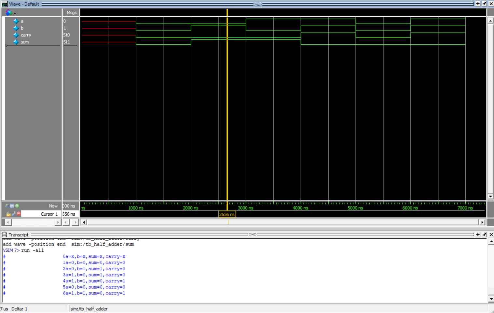

## Half Adder Design

This project implements a behavioral half adder in Verilog.

### Truth Table

| a | b | sum | carry |
|---|---|-----|-------|
| 0 | 0 |  0  |   0   |
| 0 | 1 |  1  |   0   |
| 1 | 0 |  1  |   0   |
| 1 | 1 |  0  |   1   |

### Simulation Waveform

