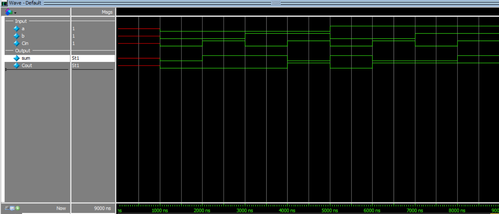
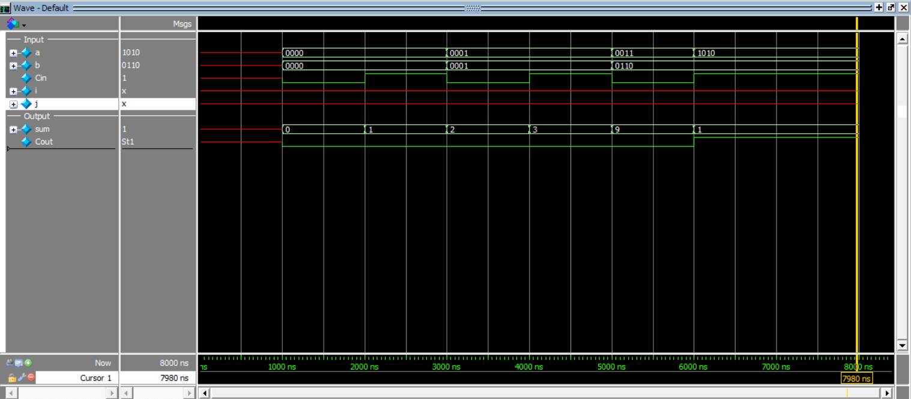
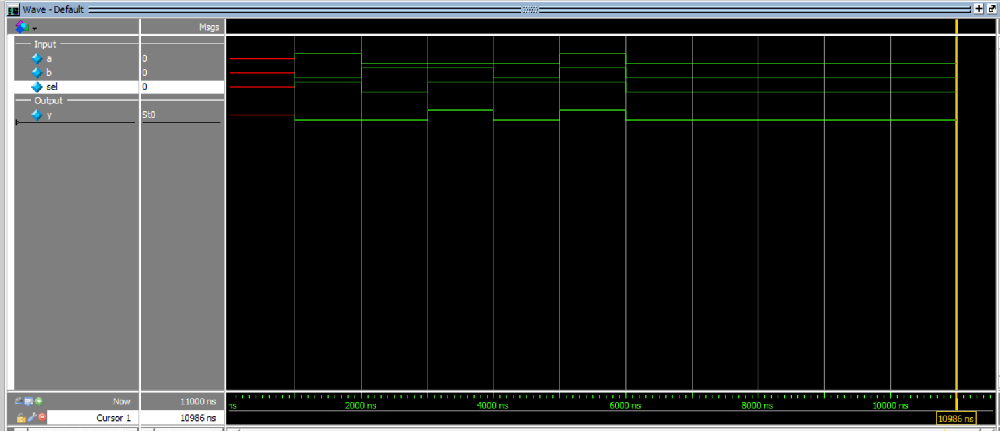
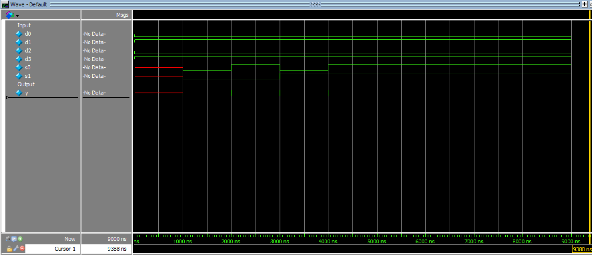
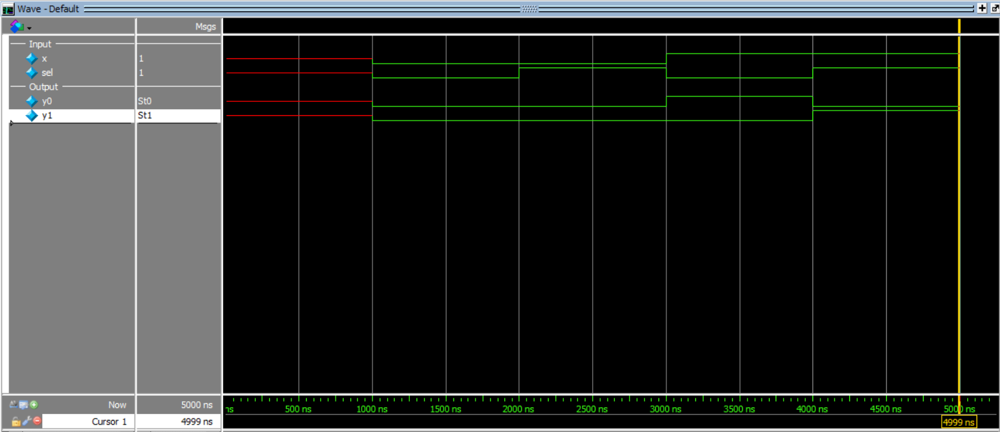

# Half Adder Design

This project implements the Half Adder in Verilog using two modeling styles:

- Behavioral modeling
- Structural modeling

## Truth Table

| a | b | sum | carry |
|---|---|-----|-------|
| 0 | 0 |  0  |   0   |
| 0 | 1 |  1  |   0   |
| 1 | 0 |  1  |   0   |
| 1 | 1 |  0  |   1   |

## Files

### RTL
- `rtl/half_adder_behavioral.v`
- `rtl/half_adder_structural.v`

### Testbenches
- `tb/tb_half_adder_behavioral.v`
- `tb/tb_half_adder_structural.v`

## Simulation Waveform


---

# Full Adder Design

This project implements a **1-bit Full Adder in Verilog using behavioral modeling**.

A Full Adder adds three input bits:

- `a`
- `b`
- `carry_in (Cin)`

and produces two outputs:

- `sum`
- `carry_out (Cout)`

---

## Logic Equations

The Full Adder logic is defined as:
sum = a ^ b ^ carry_in
carry_out = (a & b) | ((a ^ b) & carry_in

---

## Truth Table

| a | b | carry_in | sum | carry_out |
|---|---|----------|-----|-----------|
| 0 | 0 |    0     |  0  |     0     |
| 0 | 0 |    1     |  1  |     0     |
| 0 | 1 |    0     |  1  |     0     |
| 0 | 1 |    1     |  0  |     1     |
| 1 | 0 |    0     |  1  |     0     |
| 1 | 0 |    1     |  0  |     1     |
| 1 | 1 |    0     |  0  |     1     |
| 1 | 1 |    1     |  1  |     1     |

---

## Simulation Output

time=1000 | a=0 b=0 carry_in=0 | sum=0 carry_out=0
time=2000 | a=0 b=0 carry_in=1 | sum=1 carry_out=0
time=3000 | a=0 b=1 carry_in=0 | sum=1 carry_out=0
time=4000 | a=0 b=1 carry_in=1 | sum=0 carry_out=1
time=5000 | a=1 b=0 carry_in=0 | sum=1 carry_out=0
time=6000 | a=1 b=0 carry_in=1 | sum=0 carry_out=1
time=7000 | a=1 b=1 carry_in=0 | sum=0 carry_out=1
time=8000 | a=1 b=1 carry_in=1 | sum=1 carry_out=1


## Simulation Waveform



# 4-Bit Ripple Carry Adder Design

This project implements a **4-bit Ripple Carry Adder in Verilog using structural modeling**.

The design is built by connecting **four 1-bit Full Adders** in series.  
The carry output from each stage is connected to the carry input of the next stage.

### Architecture

- `FA0` adds `a[0]`, `b[0]`, and `carry_in`
- `FA1` adds `a[1]`, `b[1]`, and carry from `FA0`
- `FA2` adds `a[2]`, `b[2]`, and carry from `FA1`
- `FA3` adds `a[3]`, `b[3]`, and carry from `FA2`

This is called a **Ripple Carry Adder** because the carry propagates from the least significant bit to the most significant bit.

---

## Inputs and Outputs

### Inputs
- `a[3:0]` → 4-bit input A
- `b[3:0]` → 4-bit input B
- `carry_in` → input carry
- ### Outputs
- `sum[3:0]` → 4-bit sum output
- `carry_out` → final carry output

---

## Example Operation

For the input:

- a = 1010 (decimal 10)
- b = 0110 (decimal 6)
- carry_in = 1

The result is:


10 + 6 + 1 = 17
17 = 10001 (binary)
So the adder outputs:

- sum = 0001
- carry_out = 1


## Simulation Output

time=1000 | a=0000 b=0000 carry_in=0 | sum=0 carry_out=0
time=2000 | a=0000 b=0000 carry_in=1 | sum=1 carry_out=0
time=3000 | a=0001 b=0001 carry_in=0 | sum=2 carry_out=0
time=4000 | a=0001 b=0001 carry_in=1 | sum=3 carry_out=0
time=5000 | a=0011 b=0110 carry_in=0 | sum=9 carry_out=0
time=6000 | a=1010 b=0110 carry_in=1 | sum=1 carry_out=1

## Simulation Waveform


---

# 1-Bit 2:1 Multiplexer Design

This project implements a **1-bit 2:1 Multiplexer (MUX)** in Verilog using **structural modeling**.

A multiplexer selects one of the input signals based on the value of the select line.

### Inputs
- `a` → input 0
- `b` → input 1
- `sel` → select line

### Output
- `y` → selected output

---

## Functionality

- When `sel = 0`, output `y = a`
- When `sel = 1`, output `y = b`

---

## Logic Equation

```text
y = a·sel' + b·sel

```

This is implemented using:
1 NOT gate
2 AND gates
1 OR gate
---
## Truth Table
| a | b | sel |   y  |
|---|---|-----|------|
| 0 | 0 |  0  |   0  |
| 0 | 0 |  1  |   0  |
| 1 | 0 |  0  |   0  |
| 1 | 0 |  1  |   1  |
| 0 | 1 |  0  |   1  |
| 0 | 1 |  1  |   0  |
| 1 | 1 |  0  |   1  |
| 1 | 1 |  1  |   1  |

## Simulation Output
time=1000 | a=1 b=0 sel=1 | y=0
time=2000 | a=0 b=1 sel=0 | y=0
time=3000 | a=0 b=1 sel=1 | y=1
time=4000 | a=0 b=0 sel=1 | y=0
time=5000 | a=1 b=1 sel=1 | y=1
time=6000 | a=0 b=0 sel=0 | y=0

## Simulation Waveform


# 4:1 Multiplexer Design

This project implements a **4:1 Multiplexer (MUX)** in Verilog using **structural modeling**.

The design is built hierarchically using **three 2:1 multiplexers**.

A 4:1 multiplexer selects one of four input lines based on the values of two select signals.

### Inputs
- `d0` → input 0
- `d1` → input 1
- `d2` → input 2
- `d3` → input 3
- `s1` → most significant select bit
- `s0` → least significant select bit

### Output
- `y` → selected output

---

## Functionality

The output depends on the select lines as follows:

| s1 | s0 | Selected Input | y  |
|----|----|----------------|----|
| 0  | 0  | d0             | d0 |
| 0  | 1  | d1             | d1 |
| 1  | 0  | d2             | d2 |
| 1  | 1  | d3             | d3 |

---

## Structural Design Concept

The 4:1 MUX is created using three 2:1 MUX blocks:

- First stage:
  - MUX 1 selects between `d0` and `d1`
  - MUX 2 selects between `d2` and `d3`
- Second stage:
  - MUX 3 selects between the outputs of the first two MUX blocks

---

## Test Case Used

The following constant inputs were applied:

```text
d0 = 0
d1 = 1
d2 = 0
d3 = 1
```

The select inputs were varied through all combinations of `s1` and `s0`.

---

## Simulation Output

```
time=1000 | d0=0 d1=1 d2=0 d3=1 | s1=0 s0=0 | y=0
time=2000 | d0=0 d1=1 d2=0 d3=1 | s1=0 s0=1 | y=1
time=3000 | d0=0 d1=1 d2=0 d3=1 | s1=1 s0=0 | y=0
time=4000 | d0=0 d1=1 d2=0 d3=1 | s1=1 s0=1 | y=1
``` 
## Simulation Waveform



---

# 1-Bit 1:2 Demultiplexer Design

This project implements a **1-bit 1:2 Demultiplexer (DEMUX)** in Verilog using **structural modeling**.

A demultiplexer routes a single input signal to one of two output lines based on the value of the select signal.

### Inputs
- `x` → input data
- `sel` → select line

### Outputs
- `y0` → output 0
- `y1` → output 1

---

## Functionality

- When `sel = 0`, the input `x` is routed to `y0`
- When `sel = 1`, the input `x` is routed to `y1`

---

## Logic Equations

```text
y0 = x · sel'
y1 = x · sel

```
This is implemented using:
1 NOT gate
2 AND gates
---
## Truth Table

| x | sel | y0 | y1 |
|---|-----|----|----|
| 0 | 0 | 0 | 0 |
| 0 | 1 | 0 | 0 |
| 1 | 0 | 1 | 0 |
| 1 | 1 | 0 | 1 |

## Simulation Output

time=1000 | x=0 sel=0 y0=0 y1=0
time=2000 | x=0 sel=1 y0=0 y1=0
time=3000 | x=1 sel=0 y0=1 y1=0
time=4000 | x=1 sel=1 y0=0 y1=1

## Simulation Waveform


