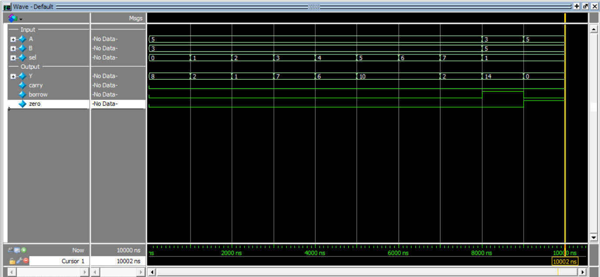

# 4-Bit ALU (Arithmetic Logic Unit)

This project implements a **4-bit Arithmetic Logic Unit (ALU)** in Verilog and verifies its functionality using ModelSim.

The ALU performs arithmetic and logical operations based on a 3-bit select signal and generates status flags.

---

## Description

The ALU takes two 4-bit inputs (`A`, `B`) and performs operations such as addition, subtraction, bitwise logic, and shifting.

It also generates:
- **carry** → for addition  
- **borrow** → for subtraction  
- **zero** → indicates if result is zero  

---

## Inputs

- `A [3:0]` → first operand  
- `B [3:0]` → second operand  
- `sel [2:0]` → operation select  

---

## Outputs

- `Y [3:0]` → result  
- `carry` → carry-out (addition)  
- `borrow` → indicates if `A < B`  
- `zero` → 1 if result is zero  

---

## Operations

| sel | Operation |
|-----|----------|
| 000 | A + B |
| 001 | A - B |
| 010 | A & B |
| 011 | A \| B |
| 100 | A ^ B |
| 101 | ~A |
| 110 | A << 1 |
| 111 | A >> 1 |

---
## Key Concepts

- Subtraction uses fixed-width arithmetic  
- When `A < B`, result is represented in 2’s complement form  
- Borrow is generated using: borrow = (A < B);

## Simulation Output

```text
time=0    | A=0101 B=0011 sel=000 | Y=1000 carry=0 borrow=0 zero=0
time=1000 | A=0101 B=0011 sel=001 | Y=0010 carry=0 borrow=0 zero=0
time=2000 | A=0101 B=0011 sel=010 | Y=0001 carry=0 borrow=0 zero=0
time=3000 | A=0101 B=0011 sel=011 | Y=0111 carry=0 borrow=0 zero=0
time=4000 | A=0101 B=0011 sel=100 | Y=0110 carry=0 borrow=0 zero=0
time=5000 | A=0101 B=0011 sel=101 | Y=1010 carry=0 borrow=0 zero=0
time=6000 | A=0101 B=0011 sel=110 | Y=1010 carry=0 borrow=0 zero=0
time=7000 | A=0101 B=0011 sel=111 | Y=0010 carry=0 borrow=0 zero=0
time=8000 | A=0011 B=0101 sel=001 | Y=1110 carry=0 borrow=1 zero=0
time=9000 | A=0101 B=0101 sel=001 | Y=0000 carry=0 borrow=0 zero=1
```
## Simulation Waveform
 
