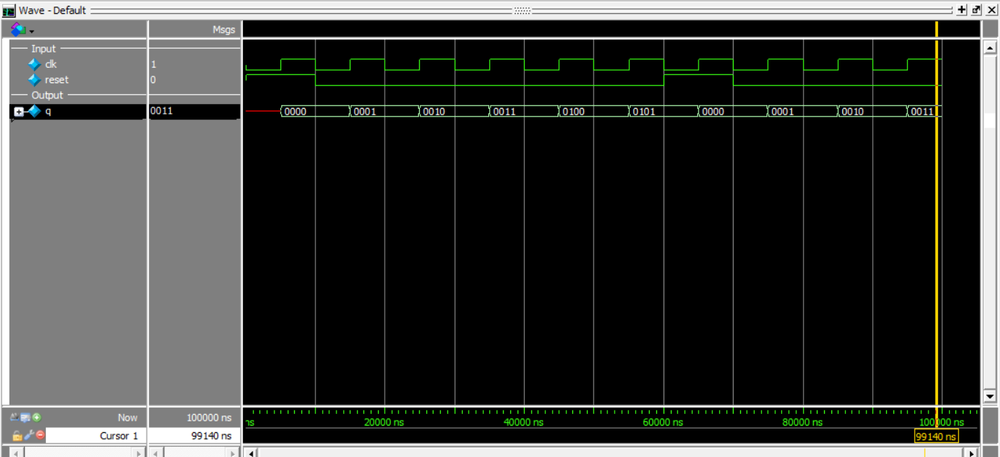

# 4-Bit Synchronous Up Counter

This project implements a **4-bit Synchronous Up Counter** in Verilog using **behavioral modeling** with a **synchronous active-high reset**.

The counter increments its value by `1` on every **positive edge of the clock** when reset is inactive.

---

## Inputs
- `clk` → clock input  
- `reset` → synchronous active-high reset  

## Outputs
- `q[3:0]` → 4-bit counter output  

---

## Operation

- On every **positive edge of `clk`**:
  - if `reset = 1` → `q = 0000`
  - else → `q = q + 1`

---

## Truth Table

| clk edge | reset | q(next)   |
|----------|-------|-----------|
| posedge  | 1     | 0000      |
| posedge  | 0     | q + 1     |

---

## Simulation Output

```text
time=0 | clk=0 reset=1 | q=xxxx
time=5000 | clk=1 reset=1 | q=0000
time=10000 | clk=0 reset=0 | q=0000
time=15000 | clk=1 reset=0 | q=0001
time=20000 | clk=0 reset=0 | q=0001
time=25000 | clk=1 reset=0 | q=0010
time=30000 | clk=0 reset=0 | q=0010
time=35000 | clk=1 reset=0 | q=0011
time=40000 | clk=0 reset=0 | q=0011
time=45000 | clk=1 reset=0 | q=0100
time=50000 | clk=0 reset=0 | q=0100
time=55000 | clk=1 reset=0 | q=0101
time=60000 | clk=0 reset=1 | q=0101
time=65000 | clk=1 reset=1 | q=0000
time=70000 | clk=0 reset=0 | q=0000
time=75000 | clk=1 reset=0 | q=0001
time=80000 | clk=0 reset=0 | q=0001
time=85000 | clk=1 reset=0 | q=0010
time=90000 | clk=0 reset=0 | q=0010
time=95000 | clk=1 reset=0 | q=0011
```
## Simulation Waveform

