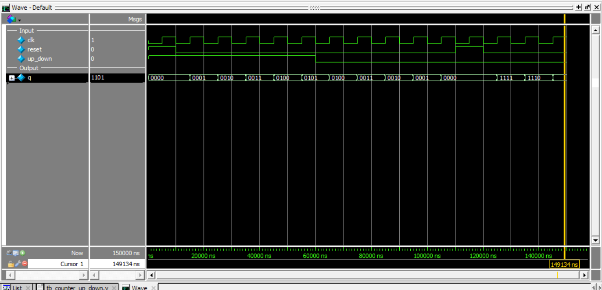

# 4-Bit Up/Down Counter (Synchronous with Async Reset)

This project implements a **4-bit Up/Down Counter** in Verilog using **behavioral modeling** with an **asynchronous active-high reset**.

The counter increments or decrements its value based on a control signal (`up_down`) on every **positive edge of the clock**.

---

## Inputs
- `clk` → clock input  
- `reset` → asynchronous active-high reset  
- `up_down` → control signal (1 = count up, 0 = count down)  

## Outputs
- `q[3:0]` → 4-bit counter output  

---

## Operation

- On every **positive edge of `clk`**:
  - if `reset = 1` → `q = 0000`
  - else:
    - if `up_down = 1` → `q = q + 1`
    - if `up_down = 0` → `q = q - 1`

---

## Truth Table (Behavior)

| clk edge | reset | up_down | q(next)        |
|----------|-------|--------|----------------|
| posedge  | 1     |   X    | 0000           |
| posedge  | 0     |   1    | q + 1          |
| posedge  | 0     |   0    | q - 1          |

---

## Counter Behavior

### Count Up (`up_down = 1`)

0000 → 0001 → 0010 → 0011 → 0100 → 0101 ...

### Count Down (`up_down = 0`)

0101 → 0100 → 0011 → 0010 → 0001 → 0000 → 1111 → 1110 ...

---

## Wrap Around Behavior

- `1111 + 1 → 0000` (overflow)  
- `0000 - 1 → 1111` (underflow)  

---

## Simulation Output

```text
time=0      | clk=0 reset=1 up_down=1 | q=0000
time=5000   | clk=1 reset=1 up_down=1 | q=0000
time=10000  | clk=0 reset=0 up_down=1 | q=0000
time=15000  | clk=1 reset=0 up_down=1 | q=0001
time=25000  | clk=1 reset=0 up_down=1 | q=0010
time=35000  | clk=1 reset=0 up_down=1 | q=0011
time=45000  | clk=1 reset=0 up_down=1 | q=0100
time=55000  | clk=1 reset=0 up_down=1 | q=0101
time=65000  | clk=1 reset=0 up_down=0 | q=0100
time=75000  | clk=1 reset=0 up_down=0 | q=0011
time=85000  | clk=1 reset=0 up_down=0 | q=0010
time=95000  | clk=1 reset=0 up_down=0 | q=0001
time=105000 | clk=1 reset=0 up_down=0 | q=0000
time=125000 | clk=1 reset=0 up_down=0 | q=1111
time=135000 | clk=1 reset=0 up_down=0 | q=1110
time=145000 | clk=1 reset=0 up_down=0 | q=1101
```
## Simulation Waveform
 ```
