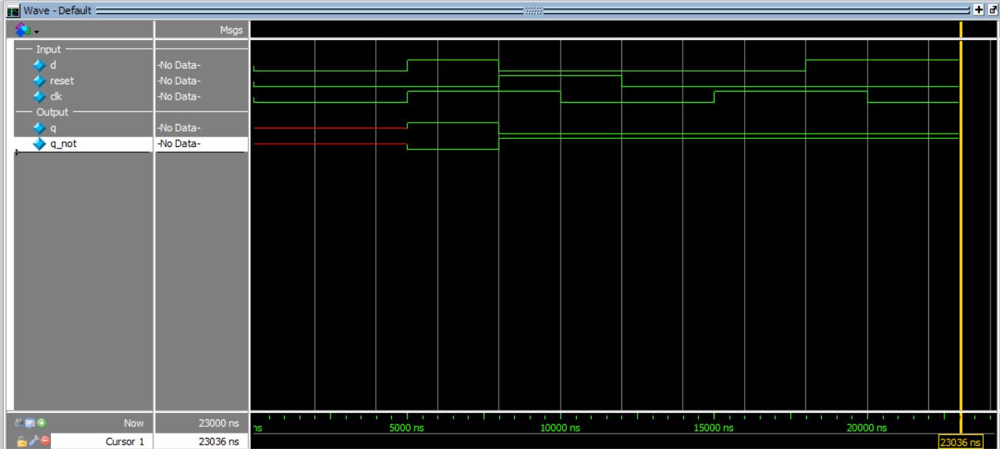

# D Flip-Flop with Asynchronous Reset

This project implements a **D Flip-Flop** in Verilog using **behavioral modeling** with an **asynchronous active-high reset**.

A D flip-flop stores the input data (`d`) at the **positive edge of the clock**. If reset is active, the output is cleared to `0` **immediately**, without waiting for the clock.

---

## Inputs
- `d` → data input  
- `clk` → clock input  
- `reset` → asynchronous active-high reset  

## Outputs
- `q` → stored output  
- `q_not` → complement of `q`  

---

## Operation

- If `reset = 1` → `q = 0` (immediate, no clock needed)
- Else on **positive edge of `clk`**:
  - `q = d`

---

## Truth Table

| reset | clk edge | d | q(next) |
|-------|----------|---|---------|
| 1     | X        | X | 0       |
| 0     | posedge  | 0 | 0       |
| 0     | posedge  | 1 | 1       |

---

## Simulation Output

```text
time=0,     |d = 0, clk = 0, reset = 0,| q = x, q_not = x
time=5000,  |d = 1, clk = 1, reset = 0,| q = 1, q_not = 0
time=8000,  |d = 0, clk = 1, reset = 1,| q = 0, q_not = 1
time=10000, |d = 0, clk = 0, reset = 1,| q = 0, q_not = 1
time=12000, |d = 0, clk = 0, reset = 0,| q = 0, q_not = 1
time=15000, |d = 0, clk = 1, reset = 0,| q = 0, q_not = 1
time=18000, |d = 1, clk = 1, reset = 0,| q = 0, q_not = 1
time=20000, |d = 1, clk = 0, reset = 0,| q = 0, q_not = 1
```

## Simulation Waveform
 ```
