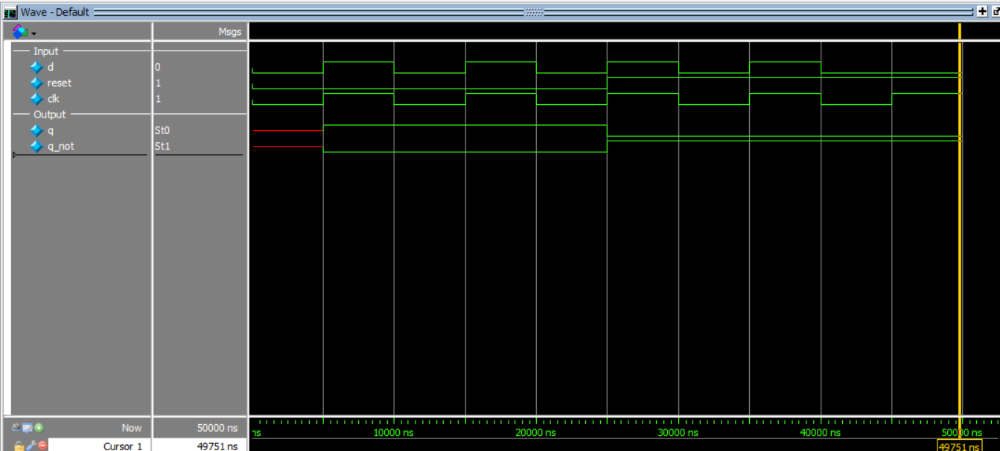

# D Flip-Flop with Synchronous Reset

This project implements a **D Flip-Flop** in Verilog using **behavioral modeling** with a **synchronous active-high reset**.

A D flip-flop stores the input data (`d`) at the **positive edge of the clock**. If reset is active during the clock edge, the output is cleared to `0`.

---

## Inputs
- `d` → data input  
- `clk` → clock input  
- `reset` → synchronous active-high reset  

## Outputs
- `q` → stored output  
- `q_not` → complement of `q`  

---

## Operation

- On every **positive edge of `clk`**:
  - if `reset = 1` → `q = 0`
  - else → `q = d`

---

## Truth Table

| clk edge | reset | d | q(next) |
|----------|-------|---|---------|
| posedge  | 0     | 0 | 0       |
| posedge  | 0     | 1 | 1       |
| posedge  | 1     | X | 0       |

---

## Simulation Output

```text
time=0, |d = 0, clk = 0, reset =  0,| q = x, q_not = x
time=5000, |d = 1, clk = 1, reset =  0,| q = 1, q_not = 0
time=10000, |d = 0, clk = 0, reset =  0,| q = 1, q_not = 0
time=15000, |d = 1, clk = 1, reset =  0,| q = 1, q_not = 0
time=20000, |d = 0, clk = 0, reset =  0,| q = 1, q_not = 0
time=25000, |d = 1, clk = 1, reset =  1,| q = 0, q_not = 1
time=30000, |d = 0, clk = 0, reset =  1,| q = 0, q_not = 1
time=35000, |d = 1, clk = 1, reset =  1,| q = 0, q_not = 1
time=40000, |d = 0, clk = 0, reset =  1,| q = 0, q_not = 1
time=45000, |d = 0, clk = 1, reset =  1,| q = 0, q_not = 1
```
## Simulation Waveform

