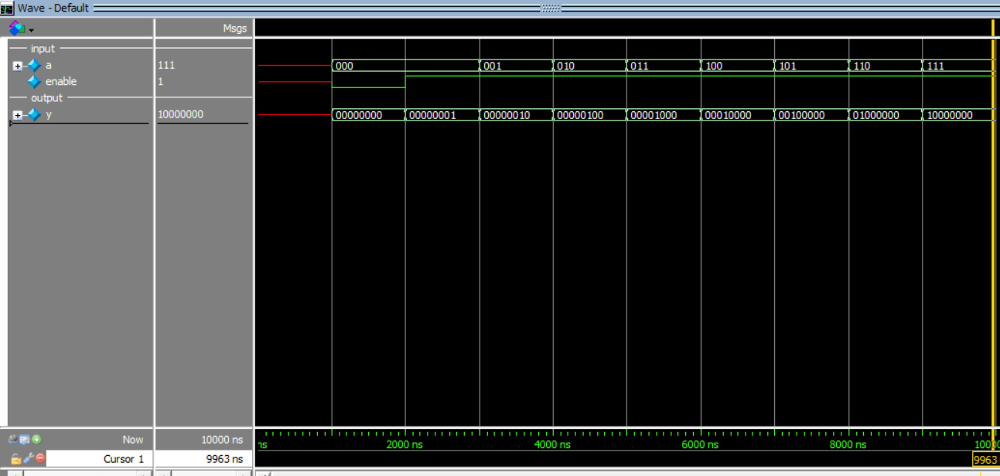

# 3-to-8 Decoder (Active-High Enable)

This project implements a **3-to-8 Decoder** in Verilog using **behavioral modeling** and verifies it using ModelSim.

A decoder converts binary input into one of many output lines. When enable is HIGH, exactly one output becomes HIGH based on the input value.

---

## Inputs
- `a[2:0]` → 3-bit input
- `enable` → active-high enable

## Outputs
- `y[7:0]` → one-hot output

---

## Truth Table

| enable | a   | y        |
|--------|-----|----------|
| 0      | XXX | 00000000 |
| 1      | 000 | 00000001 |
| 1      | 001 | 00000010 |
| 1      | 010 | 00000100 |
| 1      | 011 | 00001000 |
| 1      | 100 | 00010000 |
| 1      | 101 | 00100000 |
| 1      | 110 | 01000000 |
| 1      | 111 | 10000000 |

---

## Simulation Output

```text
time=0,|a=x,enable=x,|y=xxxxxxxx
time=1000,|a=0,enable=0,|y=00000000
time=2000,|a=0,enable=1,|y=00000001
time=3000,|a=1,enable=1,|y=00000010
time=4000,|a=2,enable=1,|y=00000100
time=5000,|a=3,enable=1,|y=00001000
time=6000,|a=4,enable=1,|y=00010000
time=7000,|a=5,enable=1,|y=00100000
time=8000,|a=6,enable=1,|y=01000000
time=9000,|a=7,enable=1,|y=10000000
```
## Simulation Waveform

