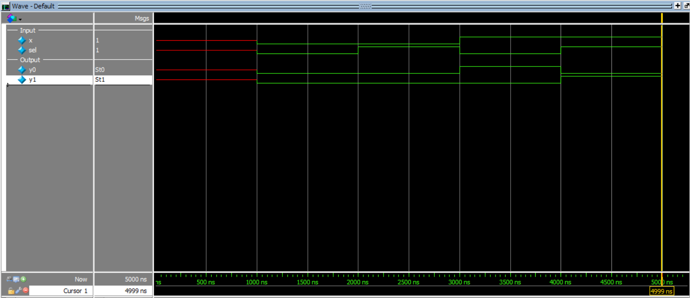

# 1-Bit 1:2 Demultiplexer Design

This project implements a **1-bit 1:2 Demultiplexer (DEMUX)** in Verilog using **structural modeling**.

A demultiplexer routes a single input signal to one of two output lines based on the value of the select signal.

### Inputs
- `x` → input data
- `sel` → select line

### Outputs
- `y0` → output 0
- `y1` → output 1

---

## Functionality

- When `sel = 0`, the input `x` is routed to `y0`
- When `sel = 1`, the input `x` is routed to `y1`

---

## Logic Equations

```text
y0 = x · sel'
y1 = x · sel

```
This is implemented using:
1 NOT gate
2 AND gates
---
## Truth Table

| x | sel | y0 | y1 |
|---|-----|----|----|
| 0 | 0 | 0 | 0 |
| 0 | 1 | 0 | 0 |
| 1 | 0 | 1 | 0 |
| 1 | 1 | 0 | 1 |

## Simulation Output
```text
time=1000 | x=0 sel=0 y0=0 y1=0
time=2000 | x=0 sel=1 y0=0 y1=0
time=3000 | x=1 sel=0 y0=1 y1=0
time=4000 | x=1 sel=1 y0=0 y1=1
```
## Simulation Waveform

