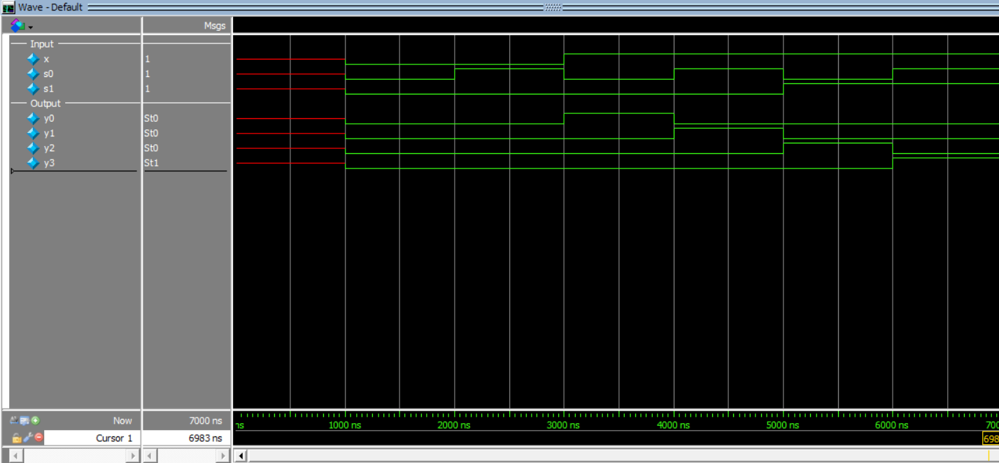

# 1-to-4 Demultiplexer (1-Bit)

This project implements a **1-to-4 Demultiplexer (DEMUX)** in Verilog using **structural modeling**.

A demultiplexer routes a single input signal to one of several outputs depending on the values of the select lines.

---

## Inputs
- `x` → input data
- `s1` → select line (MSB)
- `s0` → select line (LSB)

## Outputs
- `y0`
- `y1`
- `y2`
- `y3`

---

## Truth Table

| x | s1 | s0 | y0 | y1 | y2 | y3 |
|---|----|----|----|----|----|----|
| 0 | 0 | 0 | 0 | 0 | 0 | 0 |
| 0 | 0 | 1 | 0 | 0 | 0 | 0 |
| 1 | 0 | 0 | 1 | 0 | 0 | 0 |
| 1 | 0 | 1 | 0 | 1 | 0 | 0 |
| 1 | 1 | 0 | 0 | 0 | 1 | 0 |
| 1 | 1 | 1 | 0 | 0 | 0 | 1 |

---

## Simulation Output

```text
time=1000 | x=0 s0=0 s1=0 | y0=0 y1=0 y2=0 y3=0
time=2000 | x=0 s0=1 s1=0 | y0=0 y1=0 y2=0 y3=0
time=3000 | x=1 s0=0 s1=0 | y0=1 y1=0 y2=0 y3=0
time=4000 | x=1 s0=1 s1=0 | y0=0 y1=1 y2=0 y3=0
time=5000 | x=1 s0=0 s1=1 | y0=0 y1=0 y2=1 y3=0
time=6000 | x=1 s0=1 s1=1 | y0=0 y1=0 y2=0 y3=1
```
## Simulation Waveform
 ```
