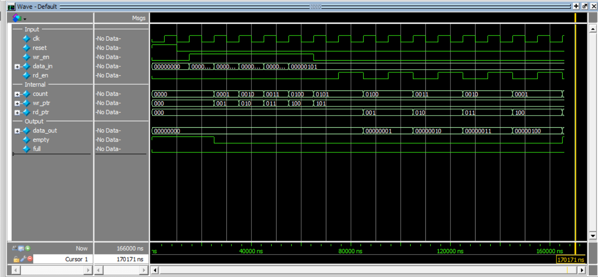

# Synchronous FIFO (First-In First-Out)

This project implements a **Synchronous FIFO** in Verilog using **behavioral modeling** with a single clock domain.

FIFO ensures data is read in the same order it is written (First-In First-Out principle).

---

## Inputs
- clk → clock signal  
- reset → active-high reset  
- wr_en → write enable  
- rd_en → read enable  
- data_in[7:0] → input data  

## Outputs
- data_out[7:0] → output data  
- full → FIFO full indicator  
- empty → FIFO empty indicator  

---

## Parameters
- DEPTH = 8 → number of locations  
- WIDTH = 8 → data width  

---

## Internal Components
- Memory array  
- Write pointer (wr_ptr)  
- Read pointer (rd_ptr)  
- Counter (count)  

---

## Operation

### Write Operation
- On posedge clk:
  - if wr_en = 1 and full = 0  
    → write data  
    → increment wr_ptr  

### Read Operation
- On posedge clk:
  - if rd_en = 1 and empty = 0  
    → read data  
    → increment rd_ptr  

---

## Counter Logic

| Condition       | Operation   |
|----------------|------------|
| Write only     | count + 1  |
| Read only      | count - 1  |
| Both / None    | No change  |

---

## Flags Logic
- full  = (count == DEPTH)  
- empty = (count == 0)  

---

## Important Behavior
- data_out updates **one clock cycle after rd_en**
- FIFO preserves order of data
- No read when empty
- No write when full

---

## Test Scenario
1. Write values: 1, 2, 3, 4, 5  
2. Read values sequentially  
3. Compare output with expected values  

---

## Simulation Output (Excerpt)

time=85000  | dout=1 → PASS  
time=105000 | dout=2 → PASS  
time=125000 | dout=3 → PASS  
time=145000 | dout=4 → PASS  
time=165000 | dout=5 → PASS  

FIFO TEST PASSED!

---

## Simulation Waveform

---
