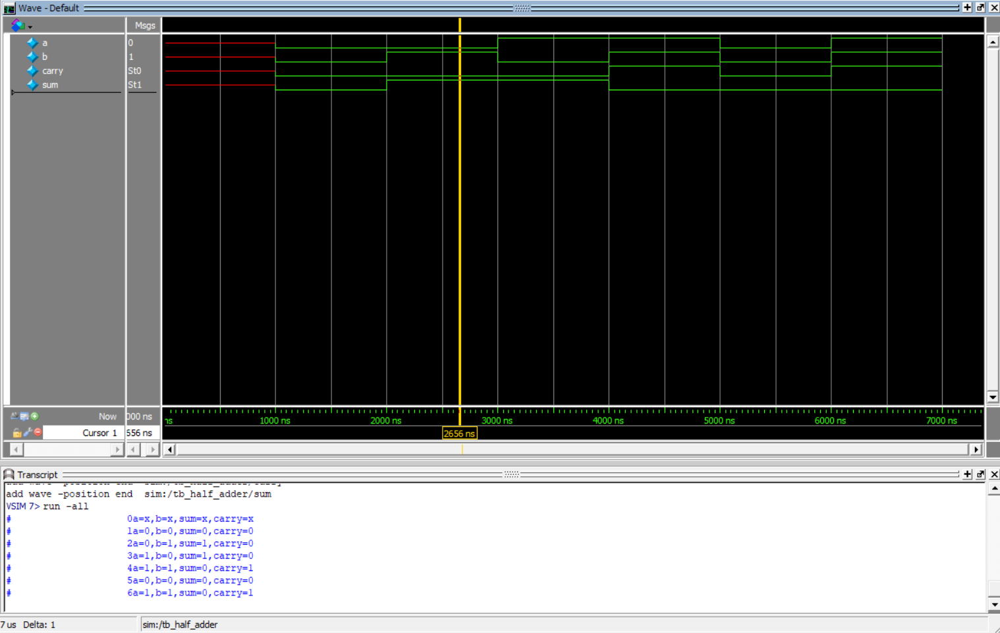

# Half Adder Design

This project implements the Half Adder in Verilog:

- Behavioral modeling

## Truth Table

| a | b | sum | carry |
|---|---|-----|-------|
| 0 | 0 |  0  |   0   |
| 0 | 1 |  1  |   0   |
| 1 | 0 |  1  |   0   |
| 1 | 1 |  0  |   1   |

## Files

### RTL
- `rtl/half_adder_behavioral.v`

### Testbenches
- `tb/tb_half_adder_behavioral.v`

## Simulation Waveform

