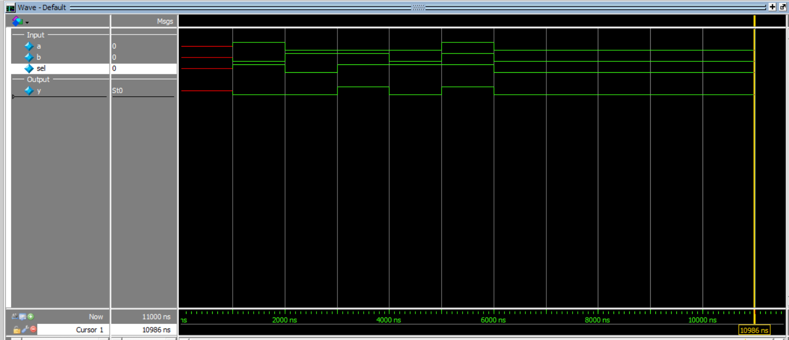

# 1-Bit 2:1 Multiplexer Design

This project implements a **1-bit 2:1 Multiplexer (MUX)** in Verilog using **structural modeling**.

A multiplexer selects one of the input signals based on the value of the select line.

### Inputs
- `a` → input 0
- `b` → input 1
- `sel` → select line

### Output
- `y` → selected output

---

## Functionality

- When `sel = 0`, output `y = a`
- When `sel = 1`, output `y = b`

---

## Logic Equation

```text
y = a·sel' + b·sel

```

This is implemented using:
1 NOT gate
2 AND gates
1 OR gate
---
## Truth Table
| a | b | sel |   y  |
|---|---|-----|------|
| 0 | 0 |  0  |   0  |
| 0 | 0 |  1  |   0  |
| 1 | 0 |  0  |   0  |
| 1 | 0 |  1  |   1  |
| 0 | 1 |  0  |   1  |
| 0 | 1 |  1  |   0  |
| 1 | 1 |  0  |   1  |
| 1 | 1 |  1  |   1  |

## Simulation Output
```text
time=1000 | a=1 b=0 sel=1 | y=0
time=2000 | a=0 b=1 sel=0 | y=0
time=3000 | a=0 b=1 sel=1 | y=1
time=4000 | a=0 b=0 sel=1 | y=0
time=5000 | a=1 b=1 sel=1 | y=1
time=6000 | a=0 b=0 sel=0 | y=0
```

## Simulation Waveform

