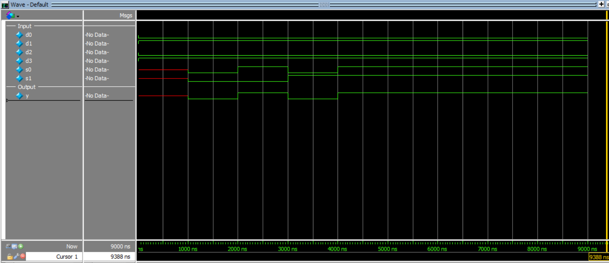

# 4:1 Multiplexer Design

This project implements a **4:1 Multiplexer (MUX)** in Verilog using **structural modeling**.

The design is built hierarchically using **three 2:1 multiplexers**.

A 4:1 multiplexer selects one of four input lines based on the values of two select signals.

### Inputs
- `d0` → input 0
- `d1` → input 1
- `d2` → input 2
- `d3` → input 3
- `s1` → most significant select bit
- `s0` → least significant select bit

### Output
- `y` → selected output

---

## Functionality

The output depends on the select lines as follows:

| s1 | s0 | Selected Input | y  |
|----|----|----------------|----|
| 0  | 0  | d0             | d0 |
| 0  | 1  | d1             | d1 |
| 1  | 0  | d2             | d2 |
| 1  | 1  | d3             | d3 |

---

## Structural Design Concept

The 4:1 MUX is created using three 2:1 MUX blocks:

- First stage:
  - MUX 1 selects between `d0` and `d1`
  - MUX 2 selects between `d2` and `d3`
- Second stage:
  - MUX 3 selects between the outputs of the first two MUX blocks

---

## Test Case Used

The following constant inputs were applied:

```text
d0 = 0
d1 = 1
d2 = 0
d3 = 1
```

The select inputs were varied through all combinations of `s1` and `s0`.

---

## Simulation Output

```text
time=1000 | d0=0 d1=1 d2=0 d3=1 | s1=0 s0=0 | y=0
time=2000 | d0=0 d1=1 d2=0 d3=1 | s1=0 s0=1 | y=1
time=3000 | d0=0 d1=1 d2=0 d3=1 | s1=1 s0=0 | y=0
time=4000 | d0=0 d1=1 d2=0 d3=1 | s1=1 s0=1 | y=1
```
## Simulation Waveform


