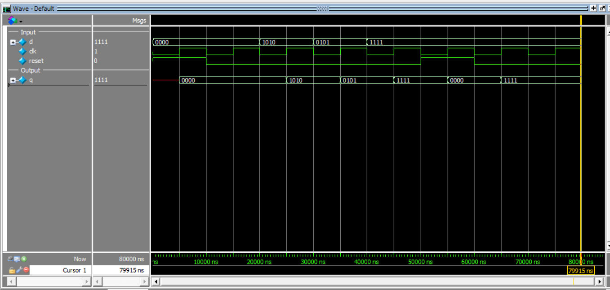

# 4-Bit Register (Synchronous Reset)

This project implements a **4-bit Register** in Verilog using **behavioral modeling** with a **synchronous active-high reset**.

A register stores multi-bit data and updates its output only at the **positive edge of the clock**.

---

## Inputs
- `d[3:0]` → 4-bit data input  
- `clk` → clock input  
- `reset` → synchronous active-high reset  

## Outputs
- `q[3:0]` → stored output  

---

## Operation

- On every **positive edge of `clk`**:
  - if `reset = 1` → `q = 0000`
  - else → `q = d`

---

## Truth Table

| clk edge | reset | d     | q(next) |
|----------|-------|-------|---------|
| posedge  | 0     | 0000  | 0000    |
| posedge  | 0     | 1010  | 1010    |
| posedge  | 0     | 0101  | 0101    |
| posedge  | 0     | 1111  | 1111    |
| posedge  | 1     | XXXX  | 0000    |

---

## Simulation Output

```text
time=0,    |d = 0000, clk = 0, reset = 1, | q = xxxx
time=5000, |d = 0000, clk = 1, reset = 1, | q = 0000
time=10000,|d = 0000, clk = 0, reset = 0, | q = 0000
time=15000,|d = 0000, clk = 1, reset = 0, | q = 0000
time=20000,|d = 1010, clk = 0, reset = 0, | q = 0000
time=25000,|d = 1010, clk = 1, reset = 0, | q = 1010
time=30000,|d = 0101, clk = 0, reset = 0, | q = 1010
time=35000,|d = 0101, clk = 1, reset = 0, | q = 0101
time=40000,|d = 1111, clk = 0, reset = 0, | q = 0101
time=45000,|d = 1111, clk = 1, reset = 0, | q = 1111
time=50000,|d = 1111, clk = 0, reset = 1, | q = 1111
time=55000,|d = 1111, clk = 1, reset = 1, | q = 0000
time=60000,|d = 1111, clk = 0, reset = 0, | q = 0000
time=65000,|d = 1111, clk = 1, reset = 0, | q = 1111
time=70000,|d = 1111, clk = 0, reset = 0, | q = 1111
time=75000,|d = 1111, clk = 1, reset = 0, | q = 1111
```
## Simulation Waveform

