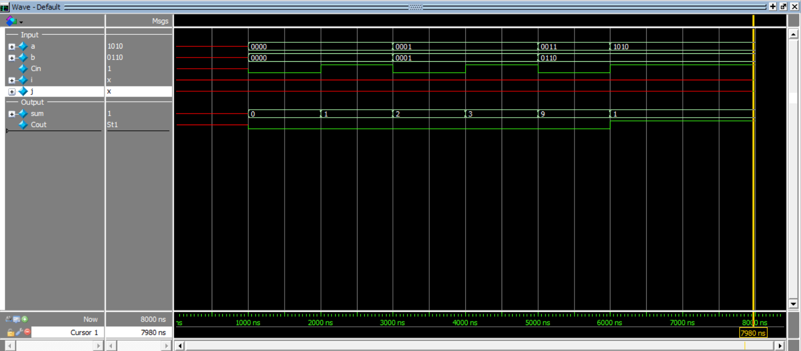

# 4-Bit Ripple Carry Adder Design

This project implements a **4-bit Ripple Carry Adder in Verilog using structural modeling**.

The design is built by connecting **four 1-bit Full Adders** in series.  
The carry output from each stage is connected to the carry input of the next stage.

### Architecture

- `FA0` adds `a[0]`, `b[0]`, and `carry_in`
- `FA1` adds `a[1]`, `b[1]`, and carry from `FA0`
- `FA2` adds `a[2]`, `b[2]`, and carry from `FA1`
- `FA3` adds `a[3]`, `b[3]`, and carry from `FA2`

This is called a **Ripple Carry Adder** because the carry propagates from the least significant bit to the most significant bit.

---

## Inputs and Outputs

### Inputs
- `a[3:0]` → 4-bit input A
- `b[3:0]` → 4-bit input B
- `carry_in` → input carry
- ### Outputs
- `sum[3:0]` → 4-bit sum output
- `carry_out` → final carry output

---

## Example Operation

For the input:

- a = 1010 (decimal 10)
- b = 0110 (decimal 6)
- carry_in = 1

The result is:


10 + 6 + 1 = 17
17 = 10001 (binary)
So the adder outputs:

- sum = 0001
- carry_out = 1


## Simulation Output
```text
time=1000 | a=0000 b=0000 carry_in=0 | sum=0 carry_out=0
time=2000 | a=0000 b=0000 carry_in=1 | sum=1 carry_out=0
time=3000 | a=0001 b=0001 carry_in=0 | sum=2 carry_out=0
time=4000 | a=0001 b=0001 carry_in=1 | sum=3 carry_out=0
time=5000 | a=0011 b=0110 carry_in=0 | sum=9 carry_out=0
time=6000 | a=1010 b=0110 carry_in=1 | sum=1 carry_out=1
```
## Simulation Waveform

