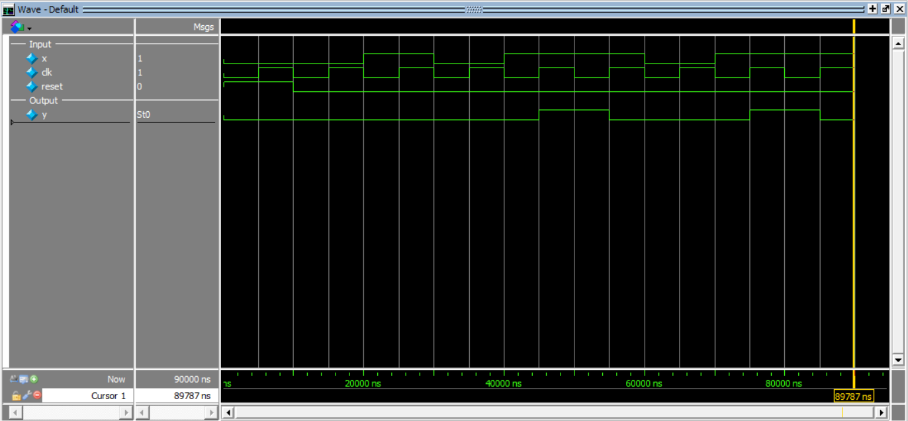

# Sequence Detector for 1011 (Mealy FSM)

This project implements a **sequence detector for 1011** in Verilog using a **Mealy Finite State Machine (FSM)** with an **asynchronous active-high reset**.

The detector monitors the serial input `x` and asserts the output `y = 1` whenever the sequence **1011** is detected.  
This design supports **overlapping sequences**.

---

## Inputs
- `x` → serial input bit  
- `clk` → clock input  
- `reset` → asynchronous active-high reset  

## Outputs
- `y` → output goes high when sequence **1011** is detected  

---

## Operation

The FSM tracks the progress of the input sequence **1011** using four states:

- `S0` → no match
- `S1` → detected `1`
- `S2` → detected `10`
- `S3` → detected `101`

### State Transitions
- From `S0`:
  - `x = 1` → go to `S1`
  - `x = 0` → stay in `S0`

- From `S1`:
  - `x = 1` → stay in `S1`
  - `x = 0` → go to `S2`

- From `S2`:
  - `x = 1` → go to `S3`
  - `x = 0` → go to `S0`

- From `S3`:
  - `x = 1` → sequence **1011** detected, `y = 1`, go to `S1` (overlapping)
  - `x = 0` → go to `S2`

---

## Truth Table (Behavior)

| Present State | Input `x` | Next State | Output `y` |
|---------------|-----------|------------|------------|
| S0            | 0         | S0         | 0          |
| S0            | 1         | S1         | 0          |
| S1            | 0         | S2         | 0          |
| S1            | 1         | S1         | 0          |
| S2            | 0         | S0         | 0          |
| S2            | 1         | S3         | 0          |
| S3            | 0         | S2         | 0          |
| S3            | 1         | S1         | 1          |

---

## Sequence Detection

Input stream applied in testbench:

```text
1 0 1 1 0 1 1
Detected sequence:

First detection at 1011
Second detection using overlapping sequence

So output y becomes 1 at the correct detection points.
```
## Simulation Output

```text
time = 0,     | x = 0, clk = 0, reset = 1, | y = 0
time = 5000,  | x = 0, clk = 1, reset = 1, | y = 0
time = 10000, | x = 0, clk = 0, reset = 0, | y = 0
time = 15000, | x = 0, clk = 1, reset = 0, | y = 0
time = 20000, | x = 1, clk = 0, reset = 0, | y = 0
time = 25000, | x = 1, clk = 1, reset = 0, | y = 0
time = 30000, | x = 0, clk = 0, reset = 0, | y = 0
time = 35000, | x = 0, clk = 1, reset = 0, | y = 0
time = 40000, | x = 1, clk = 0, reset = 0, | y = 0
time = 45000, | x = 1, clk = 1, reset = 0, | y = 1
time = 50000, | x = 1, clk = 0, reset = 0, | y = 1
time = 55000, | x = 1, clk = 1, reset = 0, | y = 0
time = 60000, | x = 0, clk = 0, reset = 0, | y = 0
time = 65000, | x = 0, clk = 1, reset = 0, | y = 0
time = 70000, | x = 1, clk = 0, reset = 0, | y = 0
time = 75000, | x = 1, clk = 1, reset = 0, | y = 1
time = 80000, | x = 1, clk = 0, reset = 0, | y = 1
time = 85000, | x = 1, clk = 1, reset = 0, | y = 0
```
## Simulation Waveform

