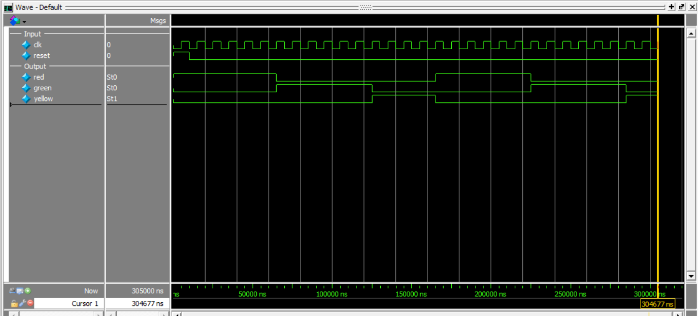

# Traffic Light Controller (FSM)

This project implements a **Traffic Light Controller** using a **Finite State Machine (FSM)** in Verilog.

The controller cycles through:
**RED → GREEN → YELLOW → RED**

---

## Inputs
- `clk` → clock signal  
- `reset` → active-high reset  

## Outputs
- `red` → red light  
- `green` → green light  
- `yellow` → yellow light  

---

## Parameters

- `RED_TIME = 5`
- `GREEN_TIME = 5`
- `YELLOW_TIME = 3`

These define how long each light stays active (in clock cycles).

---

## State Encoding

| State  | Meaning |
|--------|--------|
| RED    | 00     |
| GREEN  | 01     |
| YELLOW | 10     |

---

## Operation

- On reset → system starts in **RED**
- A counter tracks how long the system stays in each state
- When the counter reaches the defined time:
  - RED → GREEN  
  - GREEN → YELLOW  
  - YELLOW → RED  

- Counter resets on every state transition

---

## FSM Type

- **Moore FSM**
- Outputs depend only on current state

---

## Output Logic

- RED state → `red = 1`
- GREEN state → `green = 1`
- YELLOW state → `yellow = 1`

Only **one signal is active at a time**

---

## Self-Checking Testbench

A validation check ensures:
```verilog
(red + green + yellow) == 1
```

If violated:
```verilog
$display("Error: Invalid traffic light state");
$stop;
```

---

## Simulation Output (Excerpt)

```text
time = 65000  | RED = 0 GREEN = 1 YELLOW = 0
time = 125000 | RED = 0 GREEN = 0 YELLOW = 1
time = 165000 | RED = 1 GREEN = 0 YELLOW = 0
```

---

## Simulation Waveform

